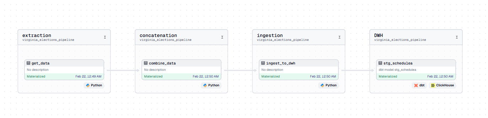

# virginia_elections_pipeline

This is a [Dagster](https://dagster.io/) project scaffolded with [`dagster project scaffold`](https://docs.dagster.io/guides/build/projects/creating-a-new-project).
The pipeline consists of 4 tasks,
1. Extraction: This node, extract data from Virginia (VA) bulk campaign finance data directory using Selenium and BeautifulSoup. Once finish, the raw data will be stored in `data/` directory.
2. Concatenation: This node will all extracted data into one single file.
3. Ingestion: One combine data will be ingested to clickhouse data warehouse.
4. DWH: After the ingestion process is done, the landing table will be transformed to staging table which consists of the first three columns.

## Getting started

First, install your Dagster code location as a Python package. By using the --editable flag, pip will install your Python package in ["editable mode"](https://pip.pypa.io/en/latest/topics/local-project-installs/#editable-installs) so that as you develop, local code changes will automatically apply.

```bash
pip install -e ".[dev]"
```

Then, start the Dagster UI web server:

```bash
dagster dev
```

Open http://localhost:3000 with your browser to see the project.

You can start writing assets in `virginia_elections_pipeline/assets.py`. The assets are automatically loaded into the Dagster code location as you define them.

## Development

### Adding new Python dependencies

You can specify new Python dependencies in `setup.py`.

### Unit testing

Tests are in the `virginia_elections_pipeline_tests` directory and you can run tests using `pytest`:

```bash
pytest virginia_elections_pipeline_tests
```

### Schedules and sensors

If you want to enable Dagster [Schedules](https://docs.dagster.io/guides/automate/schedules/) or [Sensors](https://docs.dagster.io/guides/automate/sensors/) for your jobs, the [Dagster Daemon](https://docs.dagster.io/guides/deploy/execution/dagster-daemon) process must be running. This is done automatically when you run `dagster dev`.

Once your Dagster Daemon is running, you can start turning on schedules and sensors for your jobs.

## Deploy on Dagster+

The easiest way to deploy your Dagster project is to use Dagster+.

Check out the [Dagster+ documentation](https://docs.dagster.io/dagster-plus/) to learn more.


### Answers to Final Questions
1. What are the drawbacks of the Dagster + DBT + ClickHouse approach?
```bash
Dagster + DBT + Clickhouse currently have a less mature community which based on my latest experience could cause a quite steeper learning curve for me and quite complex to maintain the framework which could become potential burden. Despite of this drawbacks, Dagster offers several advantages such as lineage tracking and data observability.
```

2. What would you do differently regarding how you spent your time on this project?
```bash
I usually do my side projects before or after working hours, and to improve my productivity, its important to setup a daily target and allocate a time to learn something new to enhance my knowledge to tackle unknown issue.
```

3. What challenges or concerns do you foresee in scaling this solution to handle data from 50 states, ultimately aggregating everything into a single final asset/table in ClickHouse?
```bash
Upcoming issue if we want to scale this solution from my perspective mainly will be performance and data management issues. Performance could be handle by horizontal or vertical scaling and implementing effective data governance to manage diversified data.    
```
